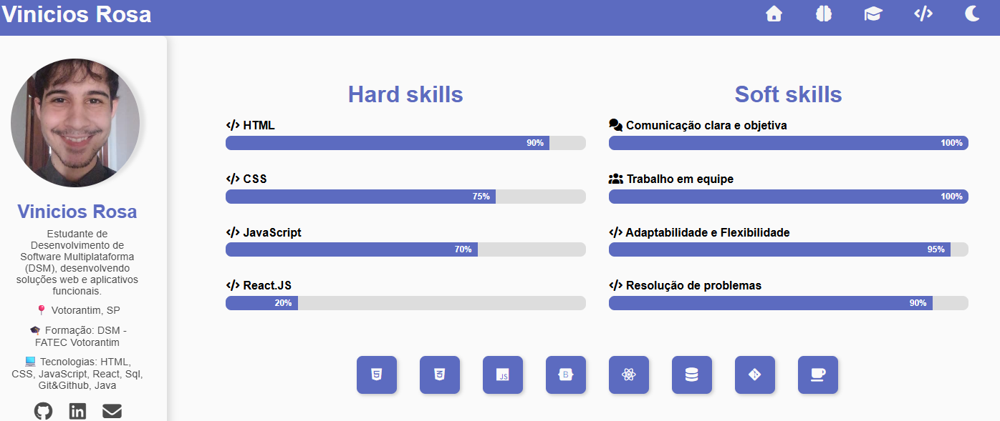

📌 Portfólio – Vinicios Rosa

Bem-vindo ao meu portfólio pessoal!
Este projeto foi desenvolvido para apresentar minhas habilidades, formações e projetos de forma organizada e moderna.

O objetivo é compartilhar minha jornada como desenvolvedor e facilitar o contato para oportunidades de estágio e networking.

🔗 Acesse o projeto online: Clique aqui

<h2 align="center">📸 Preview do Projeto</h2>

  

🛠️ Tecnologias Utilizadas

HTML5 – Estrutura do site

CSS3 – Estilização responsiva e modo dark/light

JavaScript – Interatividade e animações

Bootstrap & Font Awesome – Ícones e grid system

Lottie Web – Animação do botão de WhatsApp

✨ Funcionalidades

✅ Layout responsivo (mobile, tablet e desktop)
✅ Tema Claro/Escuro (toggle para melhor experiência do usuário)
✅ Barra lateral com foto, resumo e links sociais
✅ Sessões organizadas:

Apresentação – Quem sou e tecnologias que utilizo

Habilidades – Hard Skills e Soft Skills com barras de progresso animadas

Formação & Cursos – Graduação e cursos extras

Projetos – Cards com descrição e link direto para o GitHub
✅ Botão fixo do WhatsApp com animação para contato rápido
